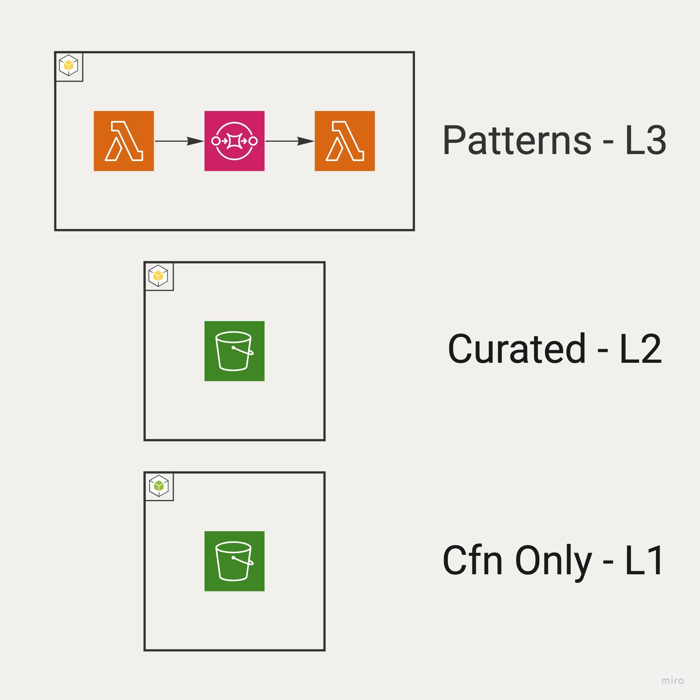
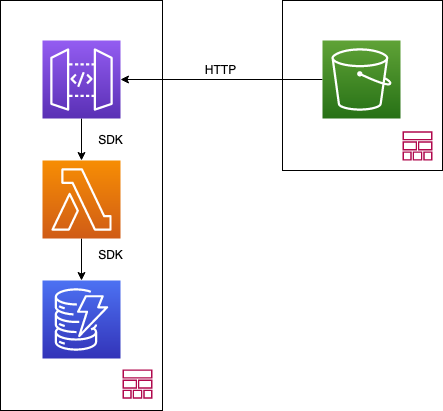

# Velkomment til CDK workshop

I løpet av denne workshopen vil du lære å deploye en enkel applikasjon til AWS ved å bruke Typescript og Cloud Development Kit.

## Hva er CDK?
[AWS Cloud Development Kit](https://aws.amazon.com/cdk/) er et prosjekt fra som startet hos AWS for å forenkle hvordan man provisjonerer og deployer applikasjoner i skyen. Den største "nyvinningen" i CDK er at man går bort ifra en rent deklerativ modell som ofte bruker [YAML](https://yaml.org/), til å skrive infrastrukturdefinisjonene i et programmeringsspråk. CDK har pr. i dag støtte for:
 - Javascript/Typescript
 - Python
 - Java
 - .NET
 - Golang

Et stort problem med konfigurasjon i YAML er at man ofte har flere veldig like definisjoner, for eksempel i en mikrotjenestearkitektur hvor hver tjeneste deler en grunnleggende arkitektur. En slik sitasjon vil ofte føre til mye kopier og lim av definisjoner som skal gjenbrukes. Men dette er jo et problem som er løst i andre deler av stacken; vi bruker funksjoner og bibliotek.

En annen fordel er enklere og mer tilgjengelig dokumentasjon. Selv om det finnes verktøy som [JSON Schema](https://json-schema.org/), så er det ikke rett frem å bruke. I CDK derimot får man like mye hjelp som man får til vanlig i det språke man bruker. Så med mindre du bruker JS så vil editoren gi deg full oversikt over hvilke alternativ du har, hvilke som er påkrevd og hvilken type disse har. Det gir mindre kognetiv last, mindre kontekstsvitsjing og lar oss som utviklere være mer effektive.

## Hvordan fungerer CDK?
AWS CDK bygger på toppen av [AWS Cloudformation](https://aws.amazon.com/cloudformation/) (CFN), destileres til syvende og sist ned til dette. Det gjør at enkelte deler av CDK låner ord og konsepter fra CFN. CDK er bygget opp i en 3+3 lags arkitektur. Som vist i figuren under deler vi først opp i App -> Stack -> Construct.

En applikasjon består av en eller flere Stacks som består av en eller flere Constructs. Stacks i CDK er akkurat mapper 1-til-1 med Stacks i CFN, og er en måte å dele opp en applikasjon i mindre, mer eller mindre frittstående biter. Constructs er mapper til én eller et fåtall ressurser som er tett knyttet sammen.

Videre er Constructs delt i nivåer, fra mest abstrakte til til mest spesifikk, Level 3 -> Level 2 -> Level 1. Dette er illustrert i figuren under. 

I AWS CDK så mapper L1 konstrukter direkte til CFN ressurser. Faktisk så er disse autogenerert fra CFN sine definisjoner slik at alle tjenester som er tilgjengelige i CFN også er tilgjengelige i CDK. Disse har alltid prefiksen `Cfn`, f. eks. er `CfnBucket` en S3 bøtte.

Level 2 konstruksjoner er enkle abstraksjoner på toppen av L1 igjen. Det er disse du helst vil jobbe med i CDK da disse har en rekke hjelpefunksjoner og standardverdier som gjør dem mye mer behagelige å jobbe med. En L2 konstruksjon mapper forsatt 1-til-1 med en CFN ressurs, men dropper prefiksen, så `Bucket` for en S3 bøtte.

Det siste nivået, Level 3, kombinerer flere ressurser til et gjenbrukbart arkitekturmønster. Dette er nyttig dersom du har flere applikasjoner som har en lik arkitekur, og lar deg enklere påkreve at visse ting er tilstede.

Siden Constructs er generelle og gjenbrukbare og CDK skrives i ekte programeringsspråk, kan de pakkes sammen og distribueres som et vanlig bibliotek enten internt eller eksternt i en organisasjon. En samling av offentlige bibliotek finnes f. eks. på [Construct Hub](https://constructs.dev/).

## Hva skal vi gjøre i denne workshopen?
Målet med workshopen er å deploye en TodoApp (veldig originalt, I know). Den består av en React.js frontend, og en backend av Lambdafunksjoner skrevet i Python som skriver til en DynamoDB. Denne arkitekturen er illustrert i figuren under. Jeg har valgt å skille applikasjonen i to Stacks, en `FrontendStack` og en `BackendStack` og instruksjonene vil ta utgangspunkt i dette.

Akkurat hvordan koden fungerer er ikke så viktig, det viktige er tjenestene som brukes til å kjøre applikasjonen.

Nå som du har litt bagrunn på hvilke problemer CDK prøver å løse og hva vi skal gjøre her, la oss begynne med å [sjekke at du har alt du trenger installert](./doc/part_1.md)
